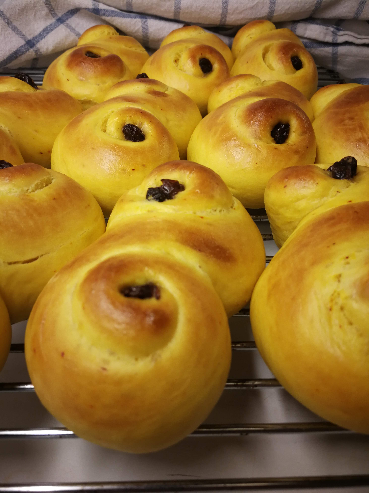
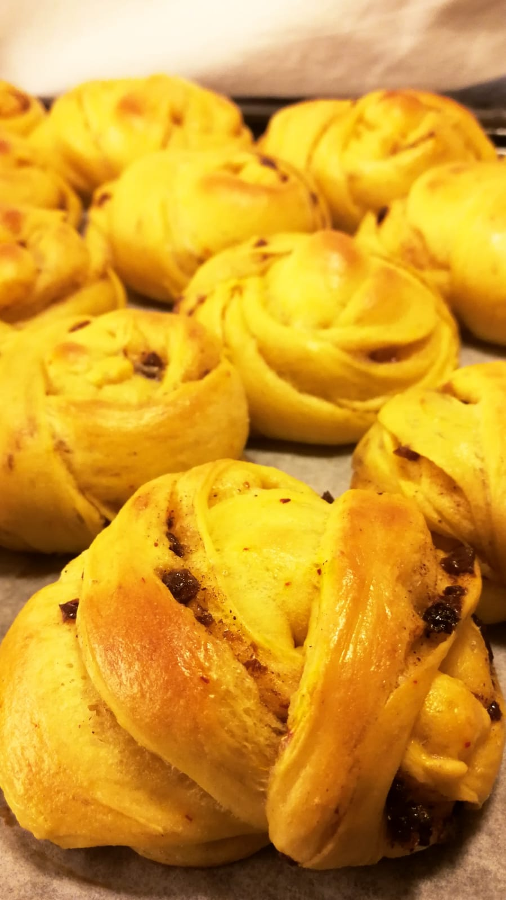

```{r setup, include=FALSE}
knitr::opts_chunk$set(echo = TRUE)
```

# Ingredients

## For the dough:
* 300 grams of bread flour
* 150 grams of milk (or oat milk)
* 70 grams of granulated sugar
* 50 grams of butter
* 1 egg (beaten)
* 5 grams of dry active yeast
* 0.5 grams of saffron

### For _lussekatter_:
* 20 raisins (preferably soaked in water or cold coffee)

### For _saffron bundles_:
* 50 grams of butter (room temperature)
* 20 grams of granulated sugar
* 1 tbsp of cinnamon and/or cardamom *or* 1 tbsp of gingerbread or pumpkin spice mix
* (_optional_) 20—30 raisins
* (_optional_) 1 tsp dried orange zest

## Instructions

1. Melt 50 grams of butter, add some of the sugar and all the saffron and let dissolve. Add the milk to the melted butter and bring the mixture to about 37°C (≈98°F), add to a large bowl. Add sugar and yeast until dissolved. Add 2/3 of the beaten egg, and then the flour in batches (preferably sifted), incorporating it into the wet ingredients. When you have a nice fluffy dough, knead for 10 mins, add small amounts of flour if needed. Let rise for 40 mins. 

2. Punch the dough which should now have doubled in size. Roll out to a quarter inch thick.

3. For _lussebullar_, follow 3a. For _saffron bundles_, follow 3b:

   a. Cut into long thin strips. Roll each strip towards the middle from one side. Turn the strip over and roll the other end towards the middle until the two rolls meet in an S shape. Place the S shaped buns on a parchment paper-lined baking sheet, push a raising into the middle of each spiral roll.

   b. Make a butter cream by the mixing room temperatured butter with the sugar and spices (optionally add finely chopped raisins and orange zest). Spread butter cream on one half of the rolled out dough, fold the other half of the dough over, flatten, and cut into long thin strips. Wrap strips into knots and place on a parchment paper-lined baking sheet.

4. Set oven to 250°C (≈480°F). Let the buns rise under a kitchen towel on the baking sheet for 40 mins.  

5. Make an egg wash with the remainder of the egg (i.e. add a tiny splash of water to it). Brush buns with the egg wash and place in the middle of the oven, reducing the heat to 225°C (≈440°F), and bake for 7—10 mins until golden brown.

6. Let the buns cool down on a wire rack under a kitchen towel.

{width=30%}   {width=22.5%}

Images: _Lussekatter_ (left); _Saffron bundles_ (right).